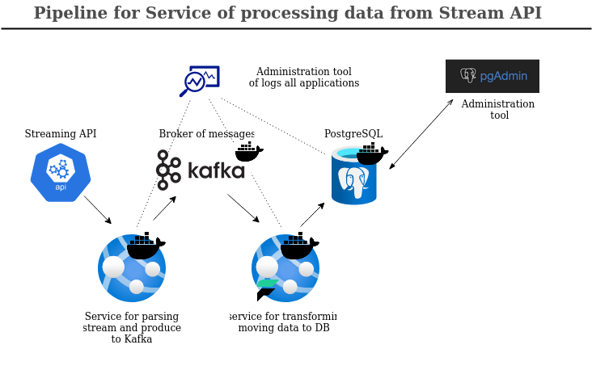
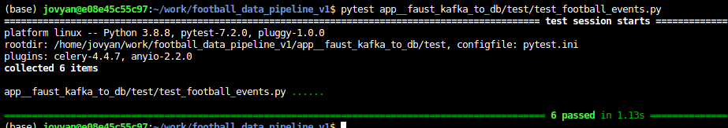
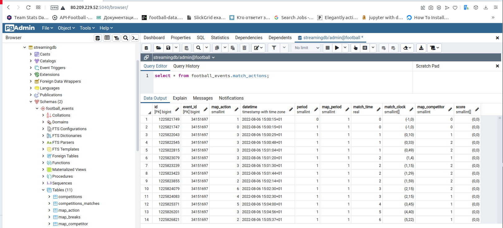

Data pipeline with using as source - samples of Football matches data with imitation Streaming API. The further points in pipeline will be Kafka, Faust framework and PostgreSQL.
# Test case of developing pipeline from streaming API up to DataBase
-----------------------------------------------------------------------------------------------------
### Task definition:

Build a data pipeline in Python that extracts and transforms the football match event data
contained as JSON files (data/tmp). These should be transformed into a set of tables that are representative of a relational
database.

<h3>As the source of data samples I will get the data from https://developer.sportradar.com </h3>

--------------------------------------------------------------------

### Task realization:

#### 1. Assumptions:

- I'll define the source of data as streaming API, by using for this application which wll be generate data from data/tmp as streaming service<br>
- On entry point  data will be a little processed  and published to Kafka as main item of sustainability in that pipeline<br>
- As main tool for parsing data and transformation to necessary instances I'll be use the Python library Faust (https://faust.readthedocs.io/en/latest/#)
which can work with Kafka and using UDF procedures for processing data in Python<br>
- As main tool for storing data I'll use PostgreSQL with administration service pgAdmin<br>
- In that example I'll  process raw layer of data and store clean data to DB. Raw layer should be uploaded at separate storage (hdfs, s3 or etc) but this is not included here - just preparation for this by using Kafka, which can store data in the queue.<br>

<h2 align="center"> Architecture<br>
  
</h2>

-------------------------------------------------------------------------------------

#### 2. Structure of data transformation

- We have next attributes within raw data : 'id', 'type', 'time', 'period', 'period_name', 'match_time', 'match_clock', 'competitor', 'outcome', 'home_score', 'away_score', 'method', 'stoppage_time', 'stoppage_time_clock', 'description', 'injury_time_announced', 'break_name', 'event_id', 'start_time', 'competition_id','competition_name','competition_gender'<br>
- According my research I'll define next instances: 
-     (1) Action's data, 
-     (2) Goals data, 
-     (3) Missed goals data, 
-     (4) Information about breaks.
<br>  I believe that these instances are usefull for BI dashboards and fast analysis for any service, also ML.

<h2 align="center"> ERD<br>

  
</h2>
(1) Action's data - contains all actions within match <br>
(2) Goals data - all actions and context of score changing<br>
(3) Missed goals data - information about risk moments <br>
(4) Information about breaks - all breaks during match

---------------------------------------------------------------------------------------------
#### 3. Prerequisites

-  Docker install (https://www.docker.com)
-  Preferable OS is Linux
-  Python install (https://www.python.org), ver 3.8
-  Provisioning : RAM from 8 Gb, CPU from 2, HDD from 20 Gb

Please, install python libraries which require at this project

```bash
_node: ~/work/football_data_pipeline_v1$ pip install -r requirements.txt
```
==========================================================================================================================================================

#### 4. Deploying main tools for storing data

First of all, please save file .env from .env.example also in root directory of project and define critical variables - credentials and paths

#### Building Kafka broker 

I need to define configs in .env file according to Kafka variables : hosts, ports and directories for mount to Kafka instance - data and properties
examples in .env.example. <br>
Next variables: KAFKA__HOST,  KAFKA__DATA (/var/kafka_logs), KAFKA__CONFIGS (/var/kafka_configs)

```bash
_node: ~/work/football_data_pipeline_v1$ mkdir /var/kafka_logs
_node: ~/work/football_data_pipeline_v1$ chmod -R 777 /var/kafka_logs
_node: ~/work/football_data_pipeline_v1$ mkdir /var/kafka_configs
_node: ~/work/football_data_pipeline_v1$ chmod -R 777 /var/kafka_configs
```

after that you can run next command

```bash
_node: ~/work/football_data_pipeline_v1$ docker-compose -f app__kafka_broker/docker-compose.yml up --build -d
```

for simple checking you can see the directory /var/kafka_logs - the existance of files according your topic which will be created during building

```bash
_node: ~/work/football_data_pipeline_v1$ ls /var/kafka_logs
```
or you can see logs of building docker container

```bash
_node: ~/work/football_data_pipeline_v1$ docker logs <container_id>
```
----------------------------------------------------------------------------------------
#### Building PostgreSQL and pgAdmin

you should define configs in env file according to PostgreSQL and PGAdmin credentials : hosts, ports and directories for mount to DB and Admin instances - data and properties
examples in .env.example


```bash
_node: ~/work/football_data_pipeline_v1$ mkdir /var/pgdata
_node: ~/work/football_data_pipeline_v1$ mkdir /var/pglogs
_node: ~/work/football_data_pipeline_v1$ mkdir /var/pgadmin_logs
```
after that you can run next command

```bash
_node: ~/work/football_data_pipeline_v1$ docker-compose -f app__db_postgresql/docker-compose.yml up --build -d
```
for simple checking you can visit through internet browser the page: http://<PG_ADMIN_HOST>:5040/browser/  and see the starting pgAdmin tool
If you are in pgAdmin - just define database instance once and you can see your DB with next structure.
During building instance of PostgreSQL there was initialized the bash script (app__db_postgresql/init_conf.sh) which installed all necessary tables and relations

--------------------------------------------------------------------------------------------------------------------
#### 5. Deploying components : source of data, intermediate and final processing

#### In case of development I'll use the Docker container from https://hub.docker.com/repository/docker/natan992021/pyflask_streaming_api/general

This is the simple imitation of streaming API with using local files (json) for publishing as stream 

Check the service and define in .env file variables in Streaming API area: PORT and Directory with data

```bash
_node: ~/work/football_data_pipeline_v1$ docker-compose -f docker-compose_stream.yml up --build -d
```

After that you can check in browser http://localhost:5556/streaming_example

or in terminal 

```bash
_node: ~/work/football_data_pipeline_v1$ curl -v http://localhost:5556/streaming_example
```

----------------------------------------------------------------------------------------------------------

#### Stage of processing data from streaming API and publishing to Kafka

This is a simple application which try to get streaming API and parsing data from input json in area key equal 'data' and without processing publish it to Kafka using connector on Python.

It's also part of my assumption, because I can use here some preprocessing or validation of data, but this is for future releases.

For running it just use next command

```bash
_node: ~/work/football_data_pipeline_v1$ python app__streaming_api_to_kafka
```

--------------------------------------------------------------------------------------------------------------

#### Stage of processing data from Kafka and making transformation by spliting to definite instances of data

This module realized by using Faust library which can work with Kafka and in asynchrony mode processing stream from Kafka and by using sink or other connector store data.

In this example I'll use python library psycopg2 (https://www.psycopg.org/docs/) which focused on developing connectors to PostgreSQL and lighter than SQLalchemy in provisioning.

First of all, please pass the tests:

```bash
_node: ~/work/football_data_pipeline_v1$ pytest app__faust_kafka_to_db/test/test_football_events.py
```

<h3 align="center"> pytest<br>

  
</h3>
These test covered all important stages of data transformation including checks for data types of critical values.

After tests you can run faust application and check the data in DB

```bash
_node: ~/work/football_data_pipeline_v1$ faust -A app__faust_kafka_to_db worker -l info
```

You can go to pgAdmin and see next picture


<h3 align="center"> football_events.match_actions<br>

  
</h3>

===============================================================================

This is one of many realisation that data pipeline